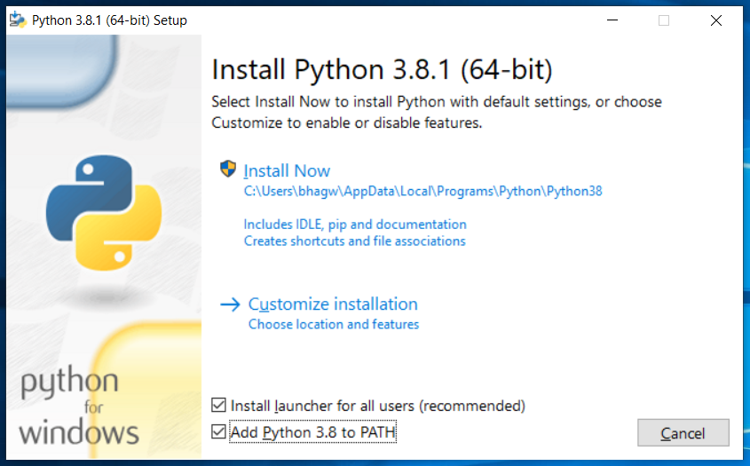
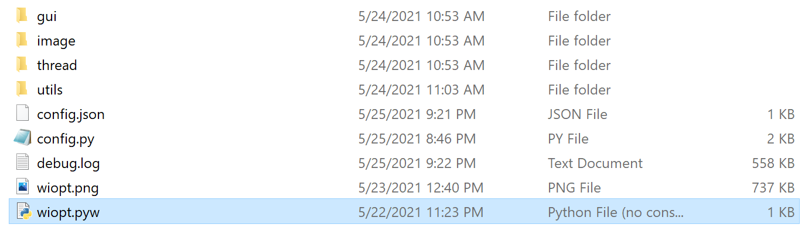
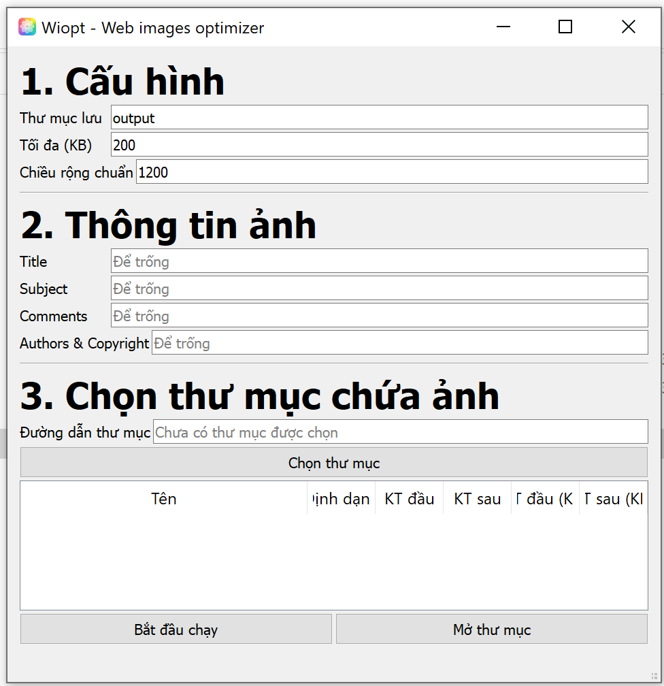

# wiopt
Web images optimizer, convert to jpeg and resize width to 1200

## Requirements
- Python3
- pillow, piexif, pyside2

## Installation
### Windows
- Install Python3 ([direct download 3.9.5](https://www.python.org/ftp/python/3.9.5/python-3.9.5-amd64.exe) or [download page](https://www.python.org/downloads/release/python-395/))

- After downloaded, run `python-3.9.5-amd64.exe`.

__Notes:__ remember to check __Add Python 3.x to PATH__, if you miss this step, just re-open `python-3.9.5-amd64.exe` and choose __Modify__.


- Open `cmd` and type the following commands:

```bash
pip install pillow, piexif
pip install pyside2
```

- Go to directory `src`, rename `wiopt.py` to `wiopt.pyw`


- Now just double click in `wiopt.pyw` and enjoy.

## Screenshots

